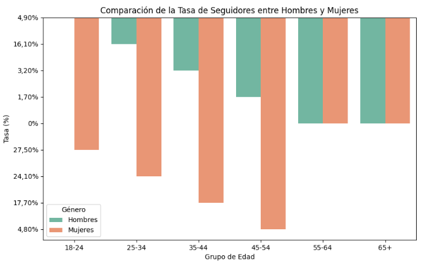

:construction: Analisis-Xanduria-red-social :construction:
</h2>

<h1>⏩⏩Trabajo en proceso</div></h1>

<h3 align=justify>Dataset</h3>
Un dataset, o conjunto de datos, es una colección estructurada de información que utilizo para analizar y comprender diferentes variables. Generalmente, lo veo como una tabla donde cada columna representa una variable específica y cada fila corresponde a un registro individual. Por ejemplo, en el dataset con el que estoy trabajando, tengo variables como:

```
  ⏺ Identificador de la publicación 
  ⏺ Identificador de la cuenta 
  ⏺ Nombre de usuario de la cuenta 
  ⏺ Nombre de la cuenta 
  ⏺ Descripción 
  ⏺ Duración (segundos) 
  ⏺ Hora de publicación 
  ⏺ Enlace permanente 
  ⏺ Tipo de publicación | Cadena (String)
  ⏺ Comentario 
  ⏺ Fecha 
  ⏺ Impresiones 
  ⏺ Alcance 
  ⏺ Me gusta
  ⏺ Veces que se compartió 
 ```
<h3 align=justify>
1. Redes Sociales Actuales
se esta utilizando ña red social de imstagran para evaluar el impacto y seguidores que se estan logrando para el juego, paguina web y marca.

2.Presencia en Redes Sociales
La presencia en redes sociales se puede analizar a través de métricas como:
Número de Seguidores: Indica el alcance potencial.
Likes y Comentarios: Reflejan el nivel de interacción y aceptación del contenido.
Shares: Miden la viralidad del contenido.

3.Información Disponible
todo lo relacionado a la informacion sobre publicacion se encuentra en "👁‍🗨 dar clic en la imagen de su interes👁‍🗨":
</h3>

<a href="https://github.com/condebufon/Analisis-Xanduria-red-social/blob/main/proyecto/datos/publicacion.csv" target="_blank">
</a>
<p></p>

<a href="https://github.com/condebufon/Analisis-Xanduria-red-social/blob/main/proyecto/graficas.ipynb" target="_blank"></a>
    
<p></p>
<a href="http://https://github.com/condebufon/Analisis-Xanduria-red-social/blob/main/proyecto/graficas.ipynb"target="_blank">
    
</a>